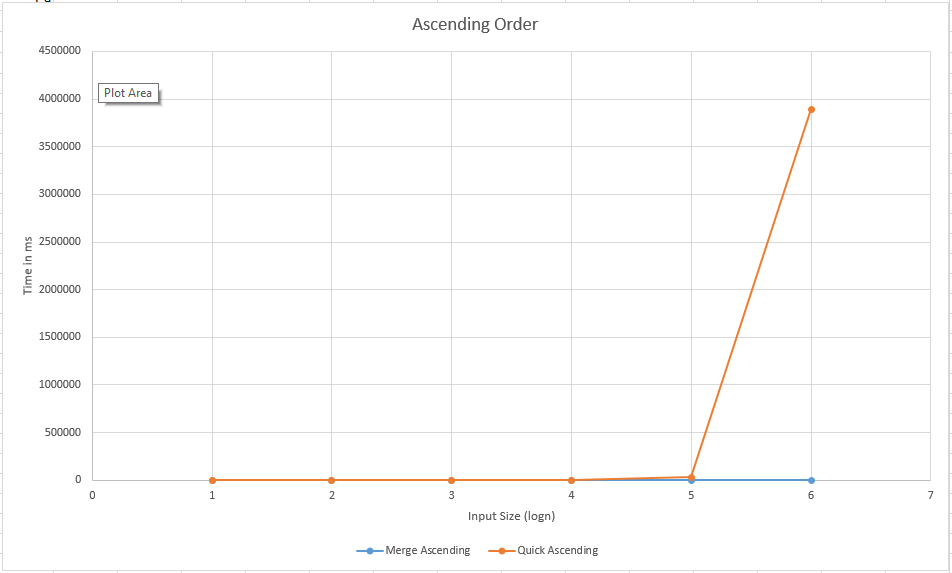
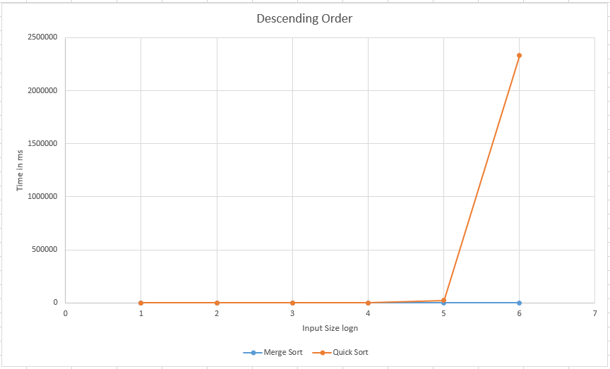
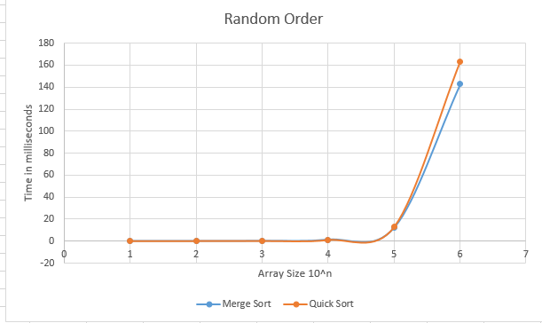
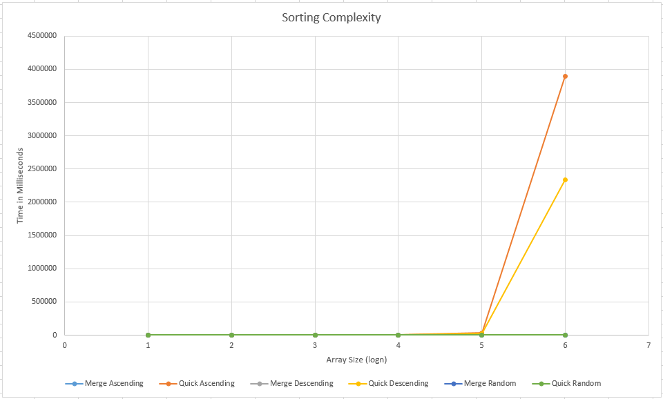
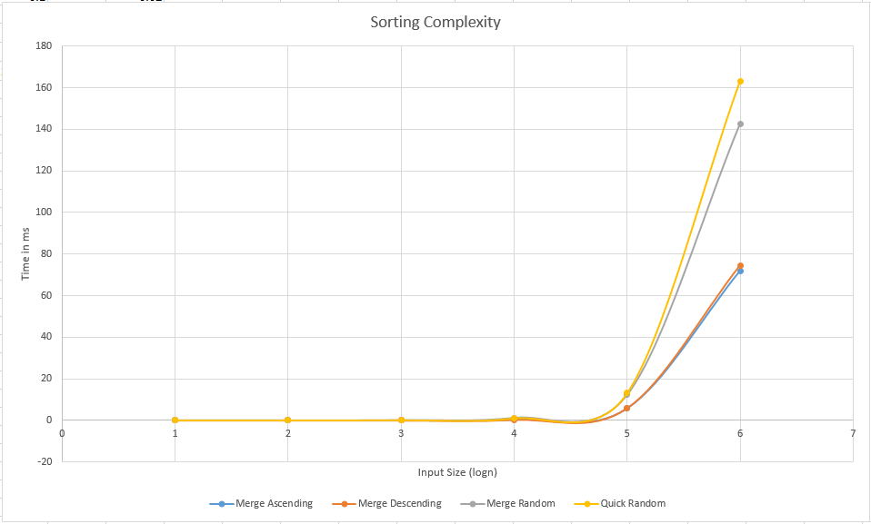

# Sessional Assignment 7 on Sorting Algorithms

In this assignment you will implement Quicksort and Merge Sort algorithms and compare their performance. The assignment includes demonstration of your implementation to the instructor during evaluation as well as a report submission using pre-generated data. 

## Complexity Analysis 

| Input Order | Sorting Algorithm | Time Complexity | Space Complexity |
| ----------- | ----------------- | --------------- | ---------------- |
| Ascending   | Merge             | O(nlogn)        | O(n)             |
| Quick       | O(n^2)            | O(n)            | O(n)             |
| Descending  | Merge             | O(nlogn)        | O(n)             |
| Quick       | O(n^2)            | O(n)            | O(n)             |
| Random      | Merge             | O(nlogn)        | O(n)             |
| Quick       | O(nlogn)          | O(n)            | O(n)             |

## Time taken in milliseconds:

| Input Order | N =      | 10       | 100      | 1000       | 10000        | 100000      | 1000000     |
| ----------- | -------- | -------- | -------- | ---------- | ------------ | ----------- | ----------- |
| Ascending   | Merge    | 0.000000 | 0.000000 | 0.020000   | 0.400000     | 5.800000    | 72.000000   |
| Quick       | 0.000000 | 0.020000 | 2.740000 | 343.420000 | 34197.800000 | 3894732.000 | 3894732.000 |
| Descending  | Merge    | 0.000000 | 0.000000 | 0.000000   | 0.300000     | 5.900000    | 74.500000   |
| Quick       | 0.000000 | 0.100000 | 1.900000 | 194.200000 | 22160.300000 | 2331852.000 | 2331852.000 |
| Random      | Merge    | 0.000000 | 0.000000 | 0.100000   | 1.200000     | 12.300000   | 142.800000  |
| Quick       | 0.000000 | 0.050000 | 0.100000 | 1.000000   | 13.100000    | 163.300000  | 163.300000  |

## Graphs:

**Ascending Order:**

**Descending Order:**

**Random Order:**

**All in One:**

## Complexity Analysis (Data based):

### Merge Sort:

We can see merge sort is providing almost consistent result in all the orders. 

**Ascending:**

T(10^5)/T(10^4) = 20, which is almost equal to (10^4*log10^4)/( 10^3*log10^3) =13.3

T(10^5)/T(10^4) = 14.5, which is almost equal to (10^5*log10^5)/( 10^4*log10^4) =12.5

T(10^6)/T(10^5) = 12.41, which is almost equal to (10^6*log10^6)/( 10^5*log10^5) = 12

So, we can say that the time complexity is n logn

**Descending:**

T(10^5)/T(10^4) = 19.66, which is almost equal to (10^5*log10^5)/( 10^4*log10^4) =12.5

T(10^6)/T(10^5) = 12.62, which is almost equal to (10^6*log10^6)/( 10^5*log10^5) = 12

So, we can say that the time complexity is n logn

 

 

**Random:**

T(10^4)/T(10^3) = 12.00, which is almost equal to (10^4*log10^4)/( 10^3*log10^3) =13.3

T(10^5)/T(10^4) = 10.25, which is almost equal to (10^5*log10^5)/( 10^4*log10^4) =12.5

T(10^6)/T(10^5) = 11.61 , which is almost equal to (10^6*log10^6)/( 10^5*log10^5) = 12

So, we can say that the time complexity is n logn

 

### Quick Sort:

**Ascending:**

T(10^4)/T(10^3) = 125.340, which is almost equal to ((10^4)^2)/(( 10^3)^2) =100

T(10^5)/T(10^4) = 99.580, which is almost equal to ((10^5)^2)/(( 10^4)^2) =100

T(10^6)/T(10^5) = 113.80, which is almost equal to ((10^6)^2)/(( 10^5)^2) = 100

So, we can say that the time complexity is n^2

**Descending:**

T(10^4)/T(10^3) = 102.21, which is almost equal to ((10^4)^2)/(( 10^3)^2) =100

T(10^5)/T(10^4) = 114.11, which is almost equal to (10000^2)/( 1000^2) =100

T(10^6)/T(10^5) = 105.23, which is almost equal to ((10^6)^2)/(( 10^5)^2) = 100

So, we can say that the time complexity is n^2

**Random:**

T(10^4)/T(10^3) = 10.00, which is almost equal to (10^4*log10^4)/( 10^3*log10^3) =13.3

T(10^5)/T(10^4) = 13.10, which is almost equal to (10^5*log10^5)/( 10^4*log10^4) =12.5

T(10^6)/T(10^5) = 12.47, which is almost equal to (10^6*log10^6)/( 10^5*log10^5) = 12

So, we can say that the time complexity is n logn

 

## Observation:

It is seen that merge sort is always providing consistent result, while quicksort provides some inconsistency. This is mainly because of the choice of pivot point. This time consumption can be omitted if the pivot s taken at the middle. But even so, an anti-case may be generated based on fixed pivot. This can be omitted by using randomized pivot. 

And again, for fixed pivot at last position, ascending order takes the maximum time. This is because the number of swap it needs is the maximum. But if we observe we will see that the swap is always occurring with itself. So, a precheck or a better performance swap may increase the efficiency by many folds. 