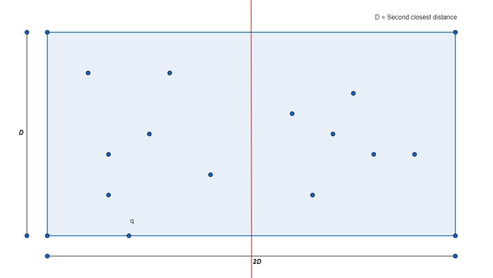
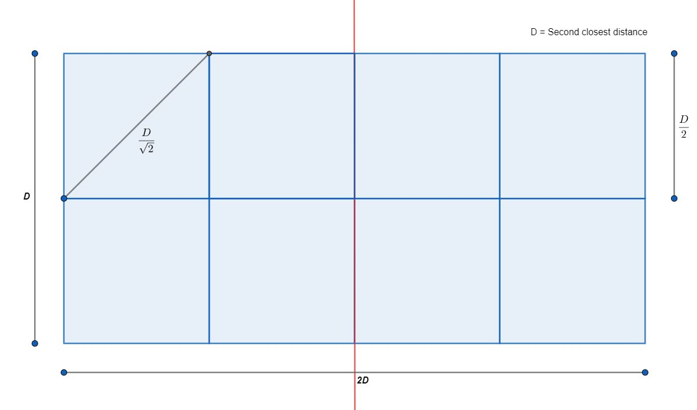
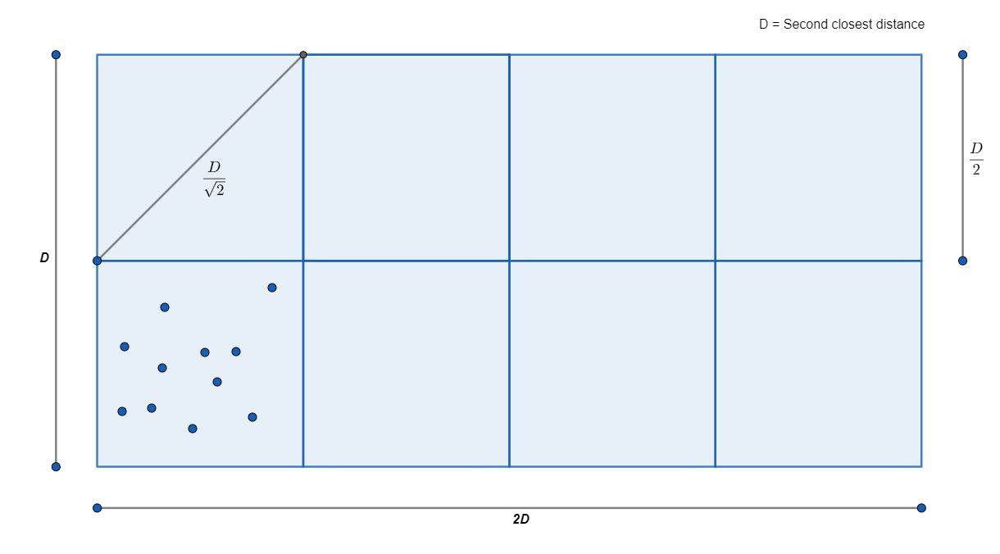
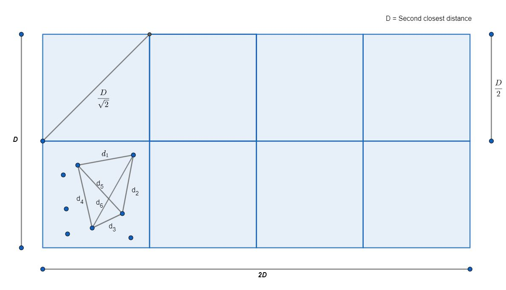
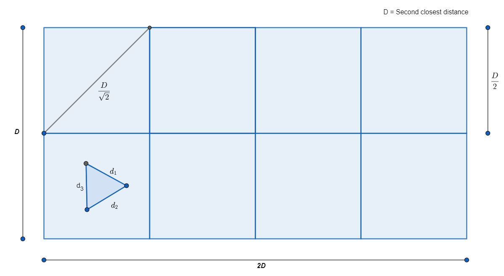
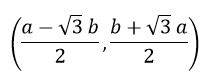
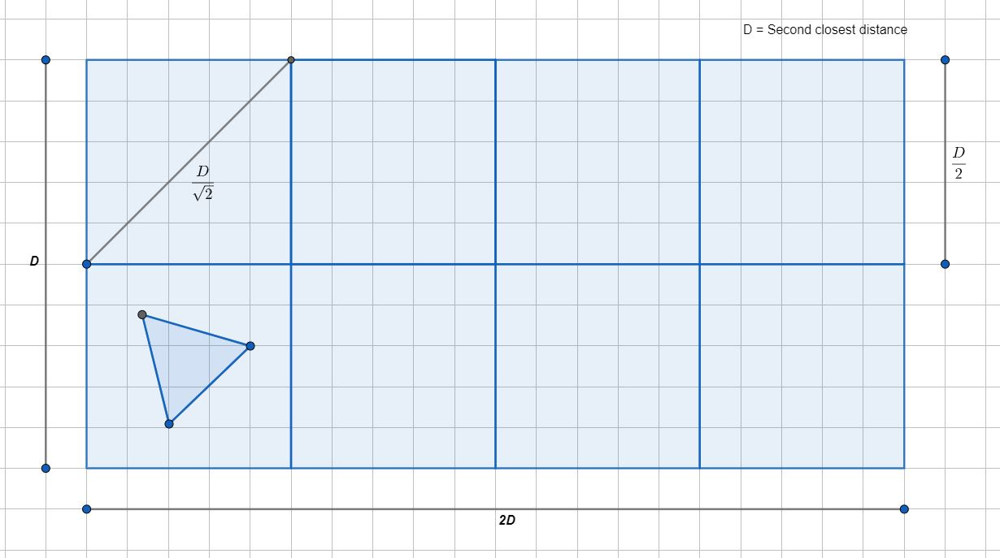

## Problem Statement:

Find the second closest distance between a set of points by Divide and Conquer in **O\(n logn)** time.

## Complexity Analysis:

**Idea:**

\1.   Sort the points according to x coordinate

\2.   Divide the points in two part

\3.   Recursively find the smallest and second smallest distance in those segments and sort according to y coordinate

\4.   Merge the two segments according to y coordinate

\5.   Merge the result for left segment and right segment

**Preset:**

best = second_best = {INF,-1,-1};
 mergeSort(points,0,n-1,compX);   //< Sorts the container according to x coordinate

 

At first we INF values in our best and second best solution. Then sort the points according to x-coordinate using merge sort. So, it will take ***O\*****(\*n\* log\*n\*)** time.

**Divide:**

```c++
int mid = (left+right)/2;
Point m = points[mid];
findClosestPair(points,left,mid); //< We are considering the points on the mid as the left seg
findClosestPair(points,mid+1,right);
```

 

Here The complexity of the recursion should be something like this:

T(n) = 2*T(n/2) + x

Here x is the complexity of the merge step. 

**Conquer:**

```c++
if( right<left ) return;
if( right - left + 1 <=3){
    for(int i=left;i<right;i++){
        for(int j=i+1;j<=right;j++)
            update(points[i],points[j]);
    }
    mergeSort(points,left,right,compY);
    return;
}
```

We have find a distance whose one point is in left segment and the other is in right segment. And in base case for size less than or equal to 3 we find the solution using brute force and sort the segment according to y coordinate. All of it done in constant time.

**Merge:**

```c++
merge(points,left,mid,right,compY);

// Store the points which has y distance smaller that the second closest distance
vector<Point> strip;
for(int i=left;i<=right;i++){
    if( abs(points[i].x-m.x)<second_best.distance )
        strip.push_back(points[i]);
}
```

 

We make a strip with both left and right segments whose distance is no more than the second smallest distance. We call these points a strip. We scan from left to righ making the complexity O(n).

```c++
void calculateStripDistance(vector<Point> &strip){
    for(int i=0;i<strip.size();i++)
        for(int j=i+1;j<strip.size() and strip[j].y-strip[i].y<second_best.distance;j++)
            update(strip[i],strip[j]);

}
```

 

Then we will scan through this strip with increasing y coordinate and calculate distance between points. Now we will show that for every point we only need to check at best 15 points. So the complexity of this step will be 15*n

**Calculation:**

T(n) = 2*T(n/2) + c*n + c*n*15 

T(n) = 2*T(n/2) + c*n*16

T(n) = 2*T(n/2) + c*n

So, Total complexity by master theorem is **O(n logn)**

Now we need to show that we actually need not to compare a point in a strip with no more than 15 points.


**Proof:**

We only take the points in the strip whose x distance from the middle segment is no more than the distance of the second closest distance.

Let the closest distance be d and the second closest distance be D.So, we will have something like this



Here, we only need to consider the points whose y distance from point of consideration, q is less than or equal to D. Cause if the point is outside this area then the distance will surely be more than D. Then we divide this segment into 8 equal segment.



So, the side of each small square is equal to D/2 and the diagonal of this square is D/sqrt(2). 

Now let there be m number of points inside a small square of length D/2.





If we consider the distance between them as d1, d2, d3, d4, d5, d6 and so on and sort them according to lowest to highest and let them be

d1, d2, d3, d4 …… 

Here, we see that all the distance are less than D/sqrt(2). Because that is the greatest distance between two points in a square. 

Now if the distances are different then we will get at least two distinct values less than D. That will result in a new distance less that D. So, all of the distances must be equal. Which can be the closest distance. But no more than that. Else we would have got that as the second closest distance. 

So, d1 = d2 = d3 = d4 = d5 ……….. But this is only possible for a set of three points whose mutual distances are equal. And that is an equilateral triangle.



 

So, we have decreased the total possible case in a square to at best 3. So, there can be a total of 3*8 = 24 points in the strip. So a total of 23 compare. 

But we can do better. As we are given with integer coordinate, we will prove that there can’t be no equilateral triangle in this case.

**Hypothesis:**

*Equilateral triangle can’t be a lattice triangle.*

**Proof:**

Lattice triangle is a triangle all of whose coordinates are integers.

Let, a lattice triangle be (0,0),(a,b),(c,d) where a,b,c,d are integers.

But if the triangle is a equilateral triangle then the value of c,d represented as the rotation of point (a,b) with angle 60 degree is



But no value of a and b except (0,0) can make that a integer coordinate, But we already have a point (0,0). So, this proves no such triangle exists.

So, Equilateral triangle can’t be a lattice triangle.



 

**Conclusion:**

So, there can be a maximum of two points inside the square of length D/2. So, we will have total of maximum 2*8 = 16 points. Which proofs that we need to compare with highest 15 points for a specific point.

Thus, we have proved our hypothesis. 

 

So, this concludes that the complexity of our algorithm is **O\(n logn)**


